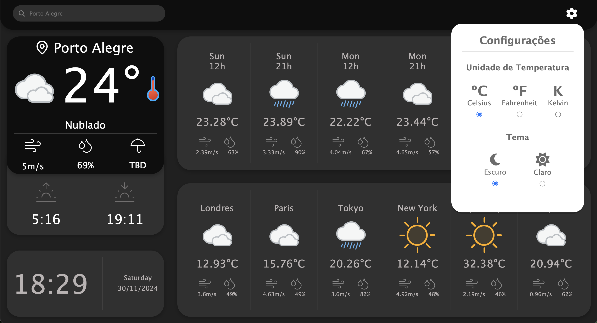

# Simple Weather App

This project is a basic weather application created to simulate the use of React for learning purposes. It allows users to check the current weather and forecast for their desired location.

### Features
- Current weather conditions
- 5-day forecast
- Minimalist design

### Demo
You can view the app live here: <a href="https://sandlerrodrigo.github.io/appClimaETempo/" target="_blank">Simple Weather App</a>

### Example
Below is a screenshot of the app in action:



### Technologies Used
- HTML, CSS, and JavaScript
- React (simulation, we are not actually using react)
- OpenWeather API (for weather data)

### How to Run Locally
1. Clone the repository:
   ```bash
   git clone https://github.com/sandlerrodrigo/appClimaETempo.git
   ```
2. Navigate to the project directory:
   ```bash
   cd appClimaETempo
   ```
3. Open the `index.html` file in your browser.
